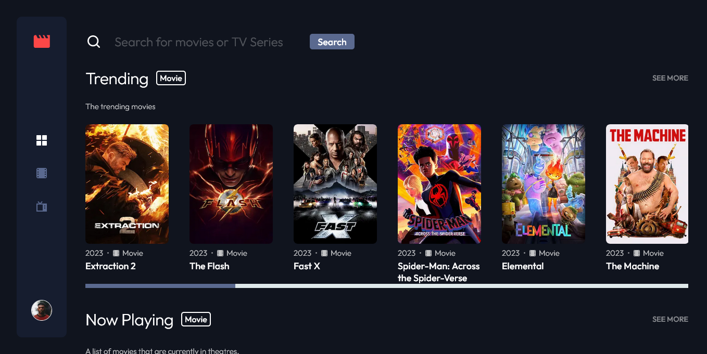

# Frontend Mentor - Entertainment web app solution

This is a solution to the [Entertainment web app challenge on Frontend Mentor](https://www.frontendmentor.io/challenges/entertainment-web-app-J-UhgAW1X). Frontend Mentor challenges help you improve your coding skills by building realistic project.

## Table of contents

- [Overview](#overview)
  - [The challenge](#the-challenge)
  - [Screenshot](#screenshot)
  - [Links](#links)
- [My process](#my-process)
  - [Built with](#built-with)
- [Author](#author)

## Overview

### The challenge

Users should be able to:

- View the optimal layout for the app depending on their device's screen size
- See hover states for all interactive elements on the page
- Navigate between Home, Movies, TV Series, and Bookmarked Shows pages
- Add/Remove bookmarks from all movies and TV series
- Search for relevant shows on all pages

### Expected Behaviour

- General
  - The navigation menu should be fixed to the left for larger screens. Use the "Desktop - Home" page in the design as a visual reference.
- Home
  - The trending section should scroll sideways to reveal other trending shows
  - Any search input should search through all shows (i.e. all movies and TV series)
- Movies
  - This page should only display shows with the "Movie" category
  - Any search input should search through all movies
- TV Series
  - This page should only display shows with the "TV Series" category
  - Any search input should search through all TV series

### Screenshot




### Links

- Solution URL: [Add solution URL here](https://your-solution-url.com)
- Live Site URL: [Add live site URL here](https://your-live-site-url.com)

## My process

### Built with

- Semantic HTML5 markup
- SEO Basic(metatags, OpenGraph)
- Acessibilidade HTML with arias attributers and roles
- CSS(Flexbox, CSS Grid, Bem Metodolody CSS Architecture)
- Normalize - Normalize CSS
- Responsive Web Design(RWD)
- Mobile-first workflow
- Typescript
- NPM
- [React](https://reactjs.org/) - JS library
  - hooks
- [Next.js](https://nextjs.org/) - React framework version 13.4.3
  - Server Components
  - Client Components
  - Metadatas Static, and dinamic
  - Loading UI, and UI Optimist
  - Route Handles 
  - Page Error Handling
  - Fetch data on the server using Server Components.
  - Fetch datas with client components with useSWR hook consumed endpoint API
- [CSS Modules](https://github.com/css-modules/css-modules) - For styles
- [SWR](https://swr.vercel.app/pt-BR/docs/getting-started) - Fetch Datas Client

## Author

- Website - [Portfolio Web](https://samuel-amaro.github.io/portfolio-web/)
- Frontend Mentor - [@samuel-amaro](https://www.frontendmentor.io/profile/Samuel-Amaro)

This is a [Next.js](https://nextjs.org/) project bootstrapped with [`create-next-app`](https://github.com/vercel/next.js/tree/canary/packages/create-next-app).

## Getting Started

First, run the development server:

```bash
npm run dev
# or
yarn dev
# or
pnpm dev
```

Open [http://localhost:3000](http://localhost:3000) with your browser to see the result.

You can start editing the page by modifying `app/page.tsx`. The page auto-updates as you edit the file.

This project uses [`next/font`](https://nextjs.org/docs/basic-features/font-optimization) to automatically optimize and load Inter, a custom Google Font.
